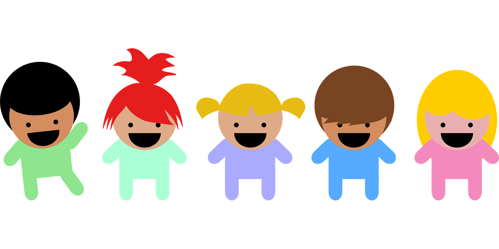
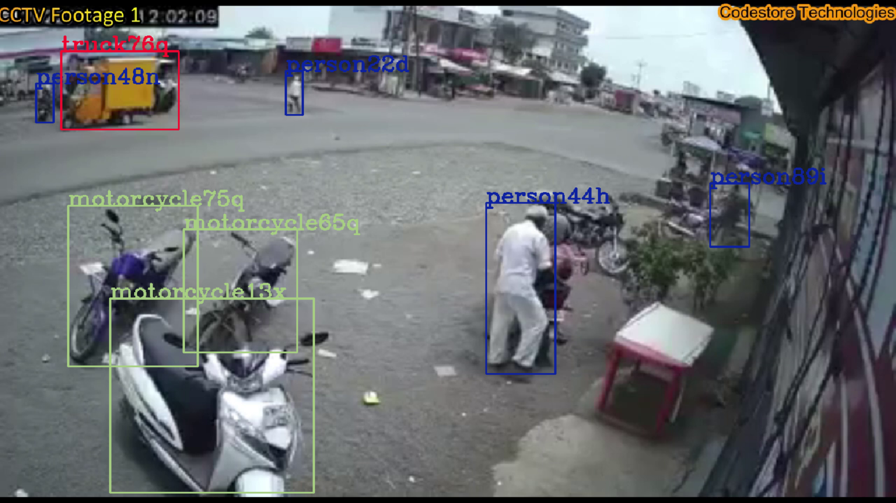

# Yolov7 Programming Guide

This README contains some useful information regarding how the programming of Yolov7 object detection and tracking has been done, with an additional feature of utilizing multiprocessors.

## Activating multi processors

```py
import multiprocessing
live_yolo_detection_process = multiprocessing.Process(target = start_ai_cam, args = (objects_detected, video_processor_active))
realTimeGenDataCollector = multiprocessing.Process(target = realTimeGeneralDataCollector, args = (objects_detected, video_processor_active))
```

The above lines of code create 2 different functions for 2 processors, the 2nd function `realTimeGeneralDataCollector()` is recursive in nature and is useful for continuosly inserting the data of count of vehicles, people, average speed of vehicles, time interval in which the observation has been taken, etc.

## Sharing data between processors

Even if a variable is set as a global variable and an attempt to edit it inside different multiprocessing function is made, both the processors will contain different values of the same variable, as if both were simply copied by value (Not by reference) in the first place.

Hence in order to create variables that'll be in sync with all multiprocessing activities, we create special proxy variables like these:

```py
manager = multiprocessing.Manager()

objects_detected = manager.dict()
video_processor_active = multiprocessing.Value("b", False)
```

In the above code snippet, a dictionary, and a boolean value has been created using multiprocessing manager object. "b" in the 4rd line references boolean values.

## Handline shared processor's data

Even after creating shared multiprocessor variables, it's not so easy to edit them, editing these special variables require some tactics.

Firstly we need to pass these shared variables as arguments, as shown in the 1st code snippet.

Then here are some important conclusions I made after studying the behaviour of shared multiprocessor variables:

```python
class abc:
    def __init__(self):
        self.var = 5
    def change_var(self):
        self.var = 10

if __name__ == '__main__':
    import multiprocessing
    manager = multiprocessing.Manager()

    a = manager.dict()
    a[1] = [abc(), abc()]
```

Here the multiprocessor dictionary `a` has instances of a class as it's values. Now if I loop over them to change the values of member `var` by executing the function `change_var()` like this:

```py
class abc:
    def __init__(self):
        self.var = 5
    def change_var(self):
        print("Attempted to change value of var to 10")
        self.var = 10

if __name__ == '__main__':
    import multiprocessing
    manager = multiprocessing.Manager()

    a = manager.dict()
    a[1] = [abc(), abc()]

    for i in range(2):
        a[1][i].change_var()
```

Now if we check if the value of `var`'s have really changed or not by executing this code:

```py
class abc:
    def __init__(self):
        self.var = 5
    def change_var(self):
        print("Attempted to change value of var to 10")
        self.var = 10

if __name__ == '__main__':
    import multiprocessing
    manager = multiprocessing.Manager()

    a = manager.dict()
    a[1] = [abc(), abc()]

    for i in range(2):
        a[1][i].change_var()

    for i in range(2):
        print(a[1][i].var)
```

The output of the above code is 

```
Attempted to change value of var to 10
Attempted to change value of var to 10
5
5
```

So, even though we expected to have the values of `var` changed, it didn't happen. Hence a method I discovered to make the snippet work as expected is this:

```py
class abc:
    def __init__(self):
        self.var = 5
    def change_var(self):
        print("Attempted to change value of var to 10")
        self.var = 10

if __name__ == '__main__':
    import multiprocessing
    manager = multiprocessing.Manager()

    a = manager.dict()
    a[1] = [abc(), abc()]
    b = a[1]

    for i in range(2):
        b[i].change_var()

    a[1] = b
    
    for i in range(2):
        print(a[1][i].var)
```

So the alternate method is to store a[key] in another variable and all the editing tasks should be done through that variable, not directly with a, later on, update the value of a[key] with b, this preserves all the editing done on instances.

## Object Tracking, The Worthy Box concept

The object tracking code has solely been written by [Mr. Sam Varghese](https://www.linkedin.com/in/sam-varghese2003/), no imports have been attempted to achieve object tracking.

So there's a concept I had to develop in order to achieve object tracking, which I've named *The Worthy Box Concept*.

Here's how it goes (this is an analogical explanation of what's coming further):

1. Assume we've a father who has children standing in front of him:



2. Now he's confused which among these children is his child


3. He somehow needs to find a worthy child in order to transfer all his properties to the child.
4. Hence he starts his new mission on finding the most worthy child among those children.
5. There can be only 1 worthy child among them to inherit the father's properties.
6. Hence in order for a child to become the most worthy among other, he has to fulfill certain conditions.


7. Ex: one of the conditions can be that the child who is nearest to the father only qualifies to be a worthy child.
8. Once the worthy child is found father will transfer all his property to that worthy child.


Let's now understand how this concept has been applied to real world object detection:

1. When videos or live CCTV footages are analyzed, Yolov7 detects all the targeted objects from it, and gives the top left, and bottom right coordinates of bounding box, along with the class, object belongs to, like person, car, truck, etc.



2. The next also gets treated the same, and all the details of objects there get extracted.
3. Now the problem is to associate the objects detected in the previous frame with the objects detected in the newly captured frame.
4. This is where the concept of *Worthy Child* comes into play.
5. Consider all the bounding boxes captured in the previous frame as *fathers* (analogically) and bounding boxes of the recently captured frames as *children*.
6. As discussed above, the task of each father now will be to select the best (*worthy*) child among all.
7. To chose the most *worthy* child, each father will firstly filter out among the children, those whose class is same as that of parent. (As bounding box of a car can't be set as a person in the next)
8. Now the 2nd criteria for selection is set to filter out the nearest bounding box among the ones available.
9. There's one more criteria that I've in mind, (not implemented yet) is to compare the shape of father and child's bounding boxes. Ones with most similarity can be selected.