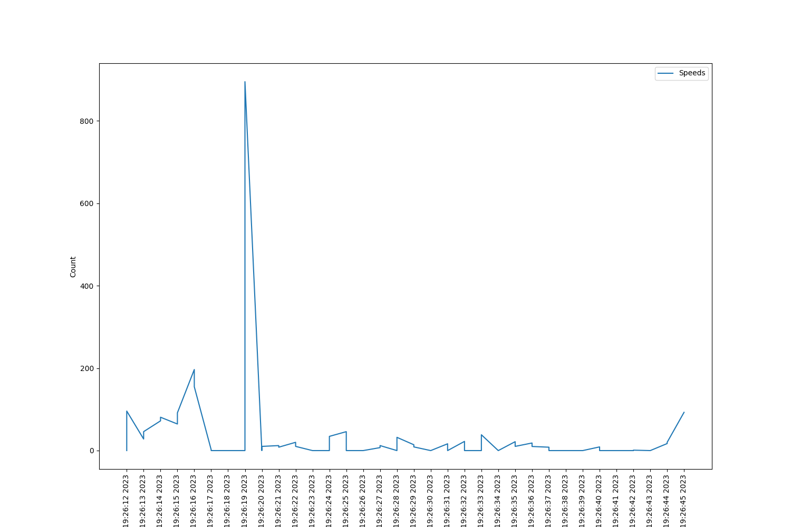
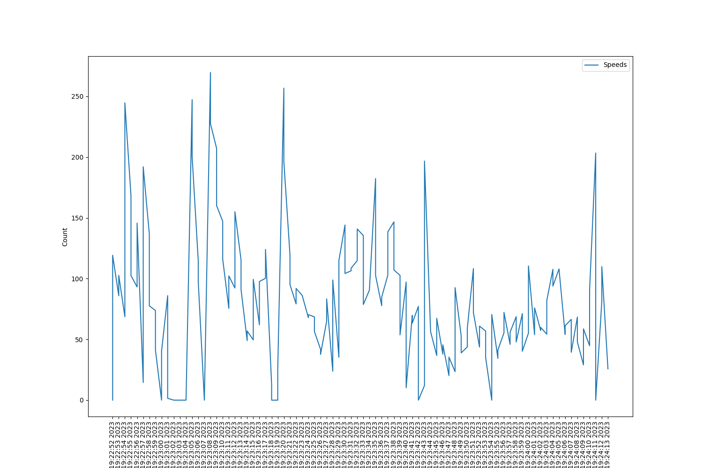
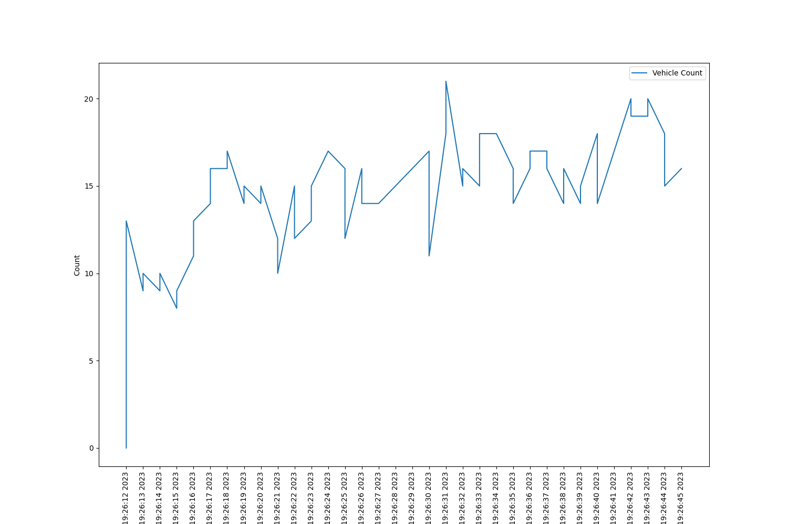
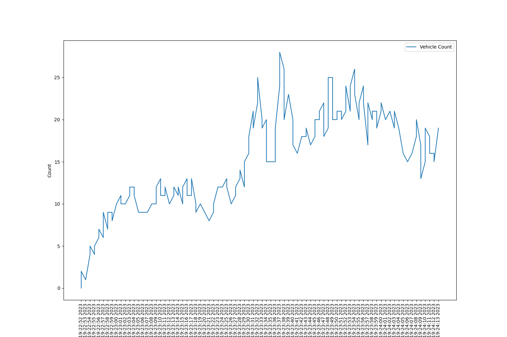
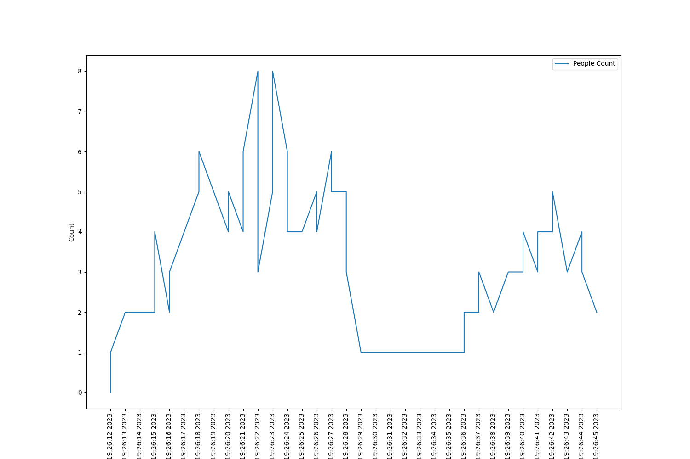
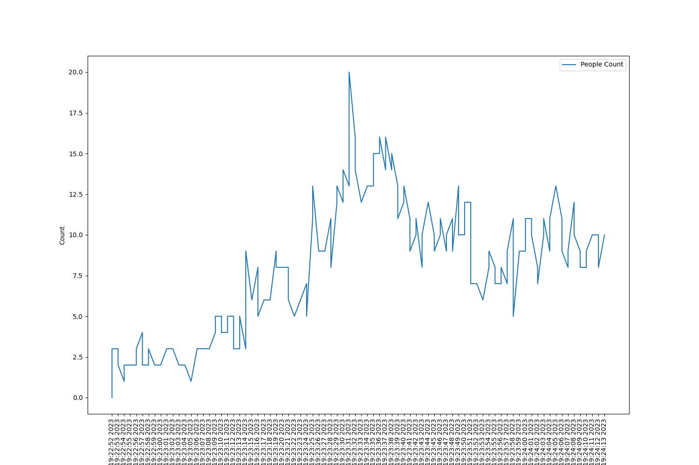
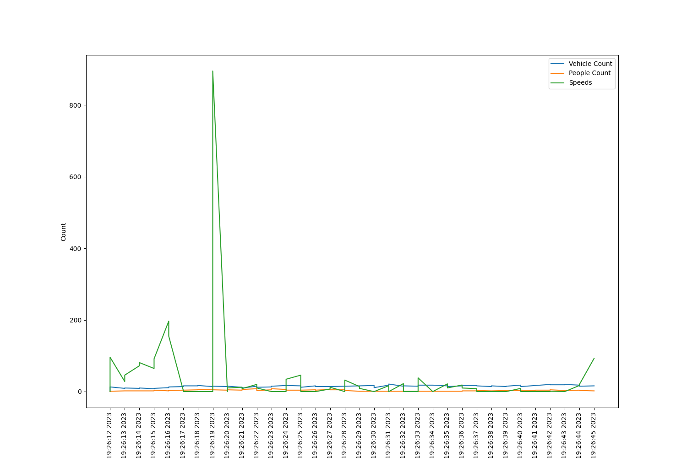
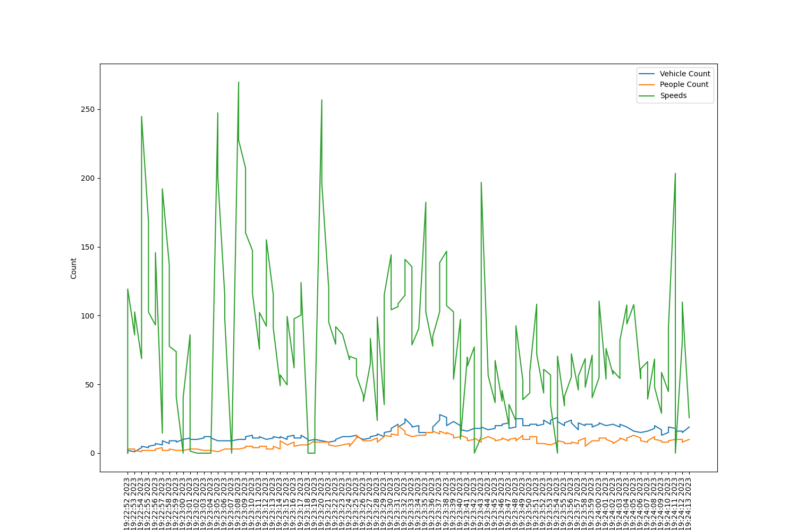

# Data Analysis of Accidents

In this document we shall be studying the trends of accidents from the downloaded videos.

## Avg Speed of vehicles

It usually happens that before accidents, average speed of vehicles is quite high and it suddently drops down to 0 mostly.

Here's a graph my program generated after recording the average speed of vehicles from the accident video 

<video src="accidents/cyberabad_traffic_incident1.mp4" controls title="Title"></video>

At 26th minute, the greatest spike that appears here is indeed tha time when incident took place in the video.

But there are some disadvantages to only keep checking the speed for accident detected, because cars might even stop instantly if traffic light turn red. (But what if there are no traffic lights ahead!)

Like here's another average speed analysis of video 

<video src="accidents/cyberabad_traffic_incident2.mp4" controls title="Title"></video>

The peak here as well is the point where accident took place.

## Vehicle Count

Because of accidents, traffic on the roads increase immediately, which can also be an identifying factor for accidents.

<video src="accidents/cyberabad_traffic_incident1.mp4" controls title="Title"></video>

<video src="accidents/cyberabad_traffic_incident2.mp4" controls title="Title"></video>

Here after 14:52, you can observe that the count of vehicles keeps increasing drastically, which is not in proportion with the traffic seen ever before. This is indeed the time when accident took place in the video.

## People Count

The crowd that gathers at the point where accident took place, is also an important factor for determing the situations of accident.

<video src="accidents/cyberabad_traffic_incident1.mp4" controls title="Title"></video>

<video src="accidents/cyberabad_traffic_incident2.mp4" controls title="Title"></video>

## People, Vehicle Count, Average Speed Combined

<video src="accidents/cyberabad_traffic_incident1.mp4" controls title="Title"></video>

<video src="accidents/cyberabad_traffic_incident2.mp4" controls title="Title"></video>

