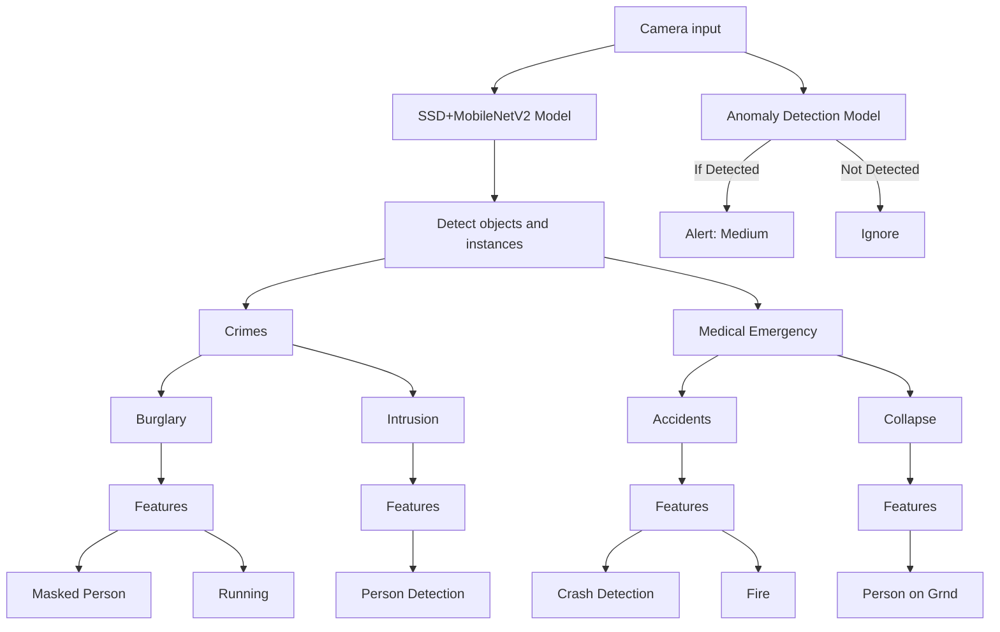

```mermaid
graph TD;
    camInp[Camera input] --> model[SSD+MobileNetV2 Model]
    camInp --> anom_det[Anomaly Detection Model]
    model --> objects[Detect objects and instances]

    anom_det-->|If Detected|al_med[Alert: Medium]
    anom_det-->|Not Detected|ign[Ignore] 
    
    objects --> crimes[Crimes]
    objects --> med[Medical Emergency]

    crimes --> burglary[Burglary]
    crimes --> intrusion[Intrusion]

    burglary-->burg_ft[Features]
    burg_ft --> masked[Masked Person]
    burg_ft --> run[Running]

    intrusion --> intr_ft[Features]
    intr_ft --> person_detect[Person Detection]

    med --> accident[Accidents]
    med --> collapse[Collapse]

    accident --> acc_ft[Features]
    acc_ft --> crash[Crash Detection]
    acc_ft --> fire[Fire]

    collapse --> coll_ft[Features]
    coll_ft --> pers_grnd[Person on Grnd]
```