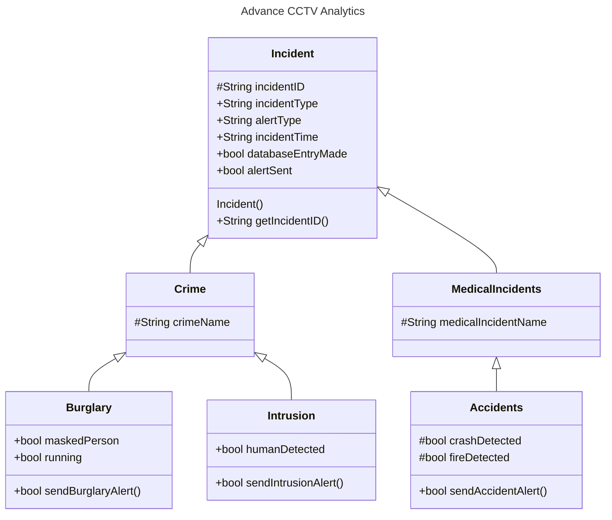

```mermaid

---
title: Advance CCTV Analytics
---
classDiagram

    Incident <|-- Crime
    Crime <|-- Burglary
    Crime <|-- Intrusion
    Incident <|-- MedicalIncidents
    MedicalIncidents<|-- Accidents

    class Incident{
        #String incidentID
        +String incidentType
        +String alertType
        +String incidentTime
        +bool databaseEntryMade
        +bool alertSent

        Incident()
        +String getIncidentID()
    }

    class Crime{
        #String crimeName
    }

    class Burglary{
        +bool maskedPerson
        +bool running

        +bool sendBurglaryAlert()
    }

    class Intrusion{
        +bool humanDetected
        +bool sendIntrusionAlert()
    }

    class MedicalIncidents{
        #String medicalIncidentName
    }

    class Accidents{
        #bool crashDetected
        #bool fireDetected
        +bool sendAccidentAlert()
    }
```
